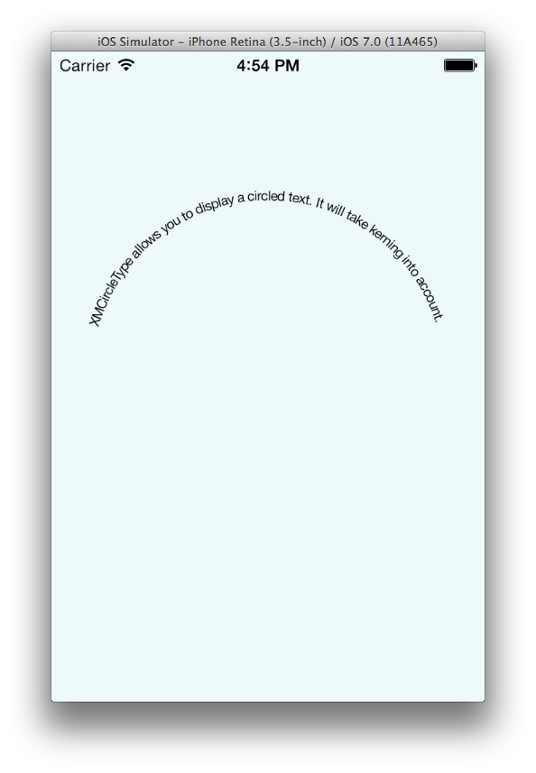

# Introduction

**XMCircleType** was written by **[Michael Teeuw](https://twitter.com/michmich)**

## What is it?

`XMCircleTypeView` is a UIView that allows you to display an NSString as a cicular text. Is will take font kerning into account, so no weird spacings.

## So what does it look like?

<!-- Remote -->
<!--  -->
<!-- Local -->

## Usage

Just add a `XMCircleTypeView` to your view, and set the desired options.
Please take a look at the example for more info.

## Disclaimer

This is my fist open source Objective-C class. So be gentle. ;)

## Contributing

Forks, patches and other feedback are welcome.